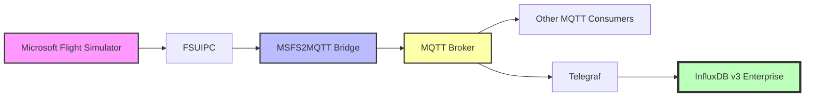

# InfluxDB v3 Enterprise Demo Integration

This guide demonstrates how to use [MSFS2MQTT](https://github.com/bendechrai/MSFS2MQTT) with InfluxDB v3 Enterprise and [Telegraf](https://github.com/influxdata/telegraf) to collect and store flight simulator data. This repo contains the visualisations.

## Overview

The demo setup consists of:

1. **MSFS + FSUIPC**: Source of flight simulator data
2. **MSFS2MQTT**: Extracts data and publishes to MQTT topics



## Setting Up InfluxDB

This demo requires a self-hosted InfluxDB v3 Enterprise instance as the high volume of data from MSFS2MQTT would likely exceed rate limits on cloud-hosted solutions.

### Self-Hosted InfluxDB v3 Enterprise Setup

1. Download [InfluxDB v3 Enterprise](https://docs.influxdata.com/influxdb3/enterprise/)

2. Extract the ZIP file to, for example, `C:\Program Files\InfluxData\influxdb`

3. Open a command prompt (`cmd`) which should open in your home folder

4. Create a location to store the influxdb data:
    ```
    mkdir influxdb_data
    ```

5. Start InfluxDB:
    ```
    "C:\Program Files\InfluxData\influxdb\influxdb3.exe" serve --node-id flightsim --object-store file --data-dir ./influxdb_data --cluster-id cluster
    ```

    > The first time you run this, you'll be asked to select a license type. Choose (1) FREE TRIAL, enter your email address, and wait for the verification email. After verifying, the command line process will complete, and InfluxDB3 will attempt to run. You might need to allow firewall access. I ticked the "Private networks, such as my home or work network" too, just in case. 

6. In another `cmd` window, run:
    ```
    "C:\Program Files\InfluxData\influxdb\influxdb3.exe" create token --admin
    ```
    to generate an admin token. **Store this in a safe space.**

7. Start this visualisation app:
    ```
    npm install
    npm run dev
    ```

8. Open http://localhost:3000 in your browser

9. Follow the setup wizard to connect to your InfluxDB instance. You'll need the Admin Token generated in step 6.

10. The setup wizard will then prompt you to create:
   - An organization (e.g., "msfs")
   - A bucket (e.g., "flightsim")
   - An API token with write permissions to your bucket

11. Save your organization ID, bucket name, and API token for the Telegraf configuration, or use the suggested config provided by the setup wizard.

## Configuring Telegraf

Telegraf will collect data from MQTT and send it to InfluxDB. An example configuration file is provided in the repository.

1. Install [Telegraf](https://docs.influxdata.com/telegraf/v1/install/)
2. Copy or create a configuration file based on the example below:

```toml
# telegraf.conf

[agent]
  interval = "1s"
  round_interval = true
  metric_batch_size = 1000
  metric_buffer_limit = 10000
  collection_jitter = "0s"
  flush_interval = "1s"
  flush_jitter = "0s"
  precision = ""
  debug = false
  quiet = false
  logtarget = "file"
  logfile = "telegraf.log"

# Read metrics from MQTT topic(s)
[[inputs.mqtt_consumer]]
  servers = ["tcp://localhost:1883"]
  topics = [
    "msfs/#"
  ]
  data_format = "json"
  json_time_key = "timestamp"
  json_time_format = "2006-01-02T15:04:05.999999999Z07:00"

# Send metrics to InfluxDB v3 Enterprise
[[outputs.influxdb_v3]]
  urls = ["http://localhost:8086"]
  token = "YOUR_TOKEN_HERE"   # Replace with your generated token
  organization = "YOUR_ORG"    # Replace with your organization name
  bucket = "flightsim"         # Replace with your bucket name
  write_lp_route = "/api/v3/write_lp" # The new v3 enterprise endpoint
```

3. Replace the placeholder values with your actual InfluxDB credentials
4. Start Telegraf with your configuration:

```bash
telegraf --config telegraf.conf
```

## Running the Demo

1. Start Microsoft Flight Simulator
2. Start your MQTT broker (e.g., Mosquitto)
3. Start Telegraf with your configuration
4. Run MSFS2MQTT:

```bash
dotnet run
```

5. Fly in the simulator for a few minutes to generate data

## Visualizing the Data

### Using InfluxDB Dashboards

1. Login to your InfluxDB instance at http://localhost:8086
2. Navigate to Dashboards
3. Create a new Dashboard
4. Add cells for the metrics you're interested in

Example SQL query to visualize altitude over time (InfluxDB v3 supports standard SQL):

```sql
SELECT value, time
FROM flightsim.autogen."msfs/altitude_feet"
WHERE time > now() - 1h
ORDER BY time DESC
```

### Using Grafana

1. Install [Grafana](https://grafana.com/grafana/download)
2. Add InfluxDB as a data source:
   - URL: http://localhost:8086
   - Auth: API Token
   - Token: Your InfluxDB token
   - Organization: Your InfluxDB org
   - Default Bucket: flightsim
   - Query Language: SQL (for InfluxDB v3)
3. Create a new dashboard
4. Add panels for important flight metrics

## Example Dashboard Ideas

1. **Flight Overview**
   - Altitude chart
   - Airspeed chart
   - Position on a map
   - Vertical speed gauge

2. **Engine Performance**
   - N1/N2 gauges
   - EGT temperature
   - Oil pressure/temperature
   - Fuel flow

3. **Control Surfaces**
   - Flaps position
   - Gear status
   - Trim positions
   - Spoilers deployment

4. **Flight Systems**
   - Autopilot status
   - Navigation radio information
   - Heading vs. track
   - Lighting systems state

## Performance Metrics

The MSFS2MQTT bridge can deliver data at approximately 60Hz (configurable), delivering real-time flight data with minimal latency. Here are some metrics from a typical setup:

- **Data points per second**: ~350-500 (depending on configured data fields)
- **CPU usage**: Typically <5% on a modern CPU
- **Memory usage**: ~60-80MB
- **Network bandwidth**: ~50-100 KB/sec (varies with update frequency)

## Extending the Demo

Some ideas to extend this demo:

1. **Add more data points**: Modify the extractors to include additional simulator variables
2. **Create more sophisticated dashboards**: Add alerts, thresholds, and complex calculations
3. **Integrate with other systems**: Forward data to other applications like Discord bots or custom displays
4. **Add replay capability**: Store flight data for later analysis and replay

## Remember: This is Just One Example

This demo showcases integration with InfluxDB v3 Enterprise, but MSFS2MQTT is designed to be versatile. Since it outputs data to standard MQTT topics, you can integrate it with virtually any system that supports MQTT, including:

- Home automation systems
- Custom hardware panels
- Other visualization tools
- Data analysis platforms
- Mobile apps

The core functionality of efficiently extracting and publishing flight simulator data remains the same regardless of your downstream use case.
