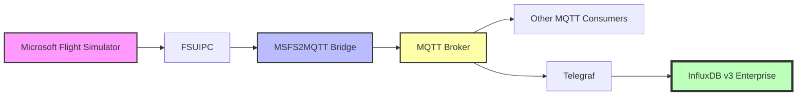

# InfluxDB v3 Enterprise Demo Integration

This guide demonstrates how to use [MSFS2MQTT](https://github.com/bendechrai/MSFS2MQTT) with InfluxDB v3 Enterprise and [Telegraf](https://github.com/influxdata/telegraf) to collect and store flight simulator data. This repo contains the visualisations.

## Overview

The demo setup consists of:

1. **MSFS + FSUIPC**: Source of flight simulator data
2. **MSFS2MQTT**: Extracts data and publishes to MQTT topics



## Setting Up InfluxDB

This demo requires a self-hosted InfluxDB v3 Enterprise instance.

### Self-Hosted InfluxDB v3 Enterprise Setup

1. Download [InfluxDB v3 Enterprise](https://docs.influxdata.com/influxdb3/enterprise/)

2. Extract the ZIP file to `C:\Program Files\InfluxData\influxdb`

3. Start InfluxDB in a PowerShell window:
    ```
    & 'C:\Program Files\InfluxData\influxdb\influxdb3.exe' serve `
      --node-id flightsim `
      --object-store file `
      --data-dir $([Environment]::GetFolderPath("MyDocuments") + "\influxdb_data\") `
      --cluster-id cluster
    ```

    > The first time you run this, you'll be asked to select a license type. Choose (1) FREE TRIAL, enter your email address, and wait for the verification email. After verifying, the command line process will complete, and InfluxDB3 will attempt to run. You might need to allow firewall access. I ticked the "Private networks, such as my home or work network" too, just in case. 

4. In another PowerShell window, run:
    ```
    & 'C:\Program Files\InfluxData\influxdb\influxdb3.exe' create token --admin
    ```
    to generate an admin token. **Store this in a safe space.**

5. Start this visualisation app:
    ```
    Set-ExecutionPolicy -Scope Process -ExecutionPolicy Bypass
    npm install
    npm run dev
    ```

6. Open http://localhost:3000 in your browser

7. Follow the setup wizard to connect to your InfluxDB instance. You'll need the Admin Token generated in step 4.

8. You'll then see a list of the buckets in your InfluxDB instance. Create a new bucket named "flightsim".

9. Click on the `</>` icon to see the API token for the bucket, then "Generate Token", and finally "Copy Token".

   > Note that you can always come back and copy the token again - this isn't a one-time operation.

## Congratulations!

You now have the demo running and reading data from InfluxDB.

Next, you'll ned to install [MSFS2MQTT](https://github.com/bendechrai/MSFS2MQTT) to collect data from your simulator and publish it to MQTT. This projct will also help you configure Telegraf to collect data from MQTT and send it to InfluxDB. The Bucket name and API token you copied in step 9 will be needed.

## Extending the Demo

Some ideas to extend this demo:

1. **Create more sophisticated dashboards**: Add alerts, thresholds, and complex calculations
2. **Integrate with other systems**: Forward data to other applications like Discord bots or custom displays
3. **Add replay capability**: Use flight data for later analysis and replay