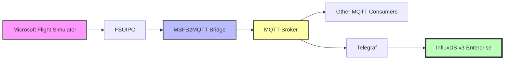

# InfluxDB v3 Enterprise Demo Integration

This guide demonstrates how to use [MSFS2Influx](https://github.com/bendechrai/MSFS2Influx) or [MSFS2MQTT](https://github.com/bendechrai/MSFS2MQTT) with InfluxDB v3 Enterprise to collect and store flight simulator data. This repo contains the visualisations.

## Overview

The demo setup consists of:

1. **InfluxDB v3**: Time series database for flight data
2. **Node.js**: Run-time environment for this demo
3. **This demo**
4. **MSFS2Influx** or **MSFS2MQTT**: Get data from FlightSim to InfluxDB

### MSFS2Influx

Probably more performant.


### MSFS2MQTT



## Setting Up InfluxDB

This demo requires a self-hosted InfluxDB v3 Enterprise instance.

### Setup

1. Download [InfluxDB v3 Enterprise](https://docs.influxdata.com/influxdb3/enterprise/)

2. Extract the ZIP file to `C:\Program Files\InfluxData\influxdb`

3. Start InfluxDB in a PowerShell window:

   ```powershell
   & 'C:\Program Files\InfluxData\influxdb\influxdb3.exe' serve `
     --node-id flightsim `
     --object-store file `
     --data-dir $([Environment]::GetFolderPath("UserProfile") + "\influxdb_data\") `
     --cluster-id cluster `
     --compaction-max-num-files-per-plan 100 `
     --compaction-gen2-duration 5m
   ```

   > ℹ️ The first time you run this, you'll be asked to select a license type. Choose (1) FREE TRIAL, enter your email address, and wait for the verification email. After verifying, the command line process will complete, and InfluxDB3 will attempt to run. You might need to allow firewall access. I ticked the "Private networks, such as my home or work network" too, just in case.

4. In another PowerShell window, run:

   ```powershell
   & 'C:\Program Files\InfluxData\influxdb\influxdb3.exe' create token --admin
   ```

   to generate an admin token. **Store this in a safe space.**

5. [Install Node.js](https://nodejs.org/en/download/)

6. Start this visualisation app from the root of the repo:

   ```powershell
   Set-ExecutionPolicy -Scope Process -ExecutionPolicy Bypass
   npm install
   npm run dev
   ```

7. Open http://localhost:3000 in your browser

8. Follow the setup wizard to connect to your InfluxDB instance. You'll need the Admin Token generated in step 4.

9. You'll then see a list of the buckets in your InfluxDB instance. Create a new bucket named "flightsim".

10. Click on the `</>` icon to see the API token for the bucket, then "Generate Token".

    > ℹ️ Note that you can always come back and find this token here - this isn't a one-time operation.

## Database Size

Currently, to get database size showing, you'll need to edit `config.json` in the repo root manually to add the `dataPath` as a top-level property:

```json
{
  ...
  "dataPath": "C:\\Users\\yourname\\influxdb_data\\flightsim",
  ...
}
```

> 💡 Your data path is created by InfluxDB when you first start it above, and can be generated by running the following in a PowerShell window:

```powershell
echo $([Environment]::GetFolderPath("UserProfile") + "\influxdb_data\")
```

> ℹ️ Note: that this file won't exists until after you've completed the setup wizard mentioned in the Setup section.

## Congratulations!

You now have the demo running and reading data from InfluxDB.

Next, you'll ned to install [MSFS2Influx](https://github.com/bendechrai/MSFS2Influx) to collect data from your simulator and publish it to InfluxDB. The Bucket name and API token you copied in step 10 will be needed.

> 💡 Another option is to use [MSFS2MQTT](https://github.com/bendechrai/MSFS2MQTT) and [Telegraf](https://docs.influxdata.com/telegraf/v1/) to collect data from your simulator and publish it to InfluxDB. This might be less performant, but it's a bit more flexible.
